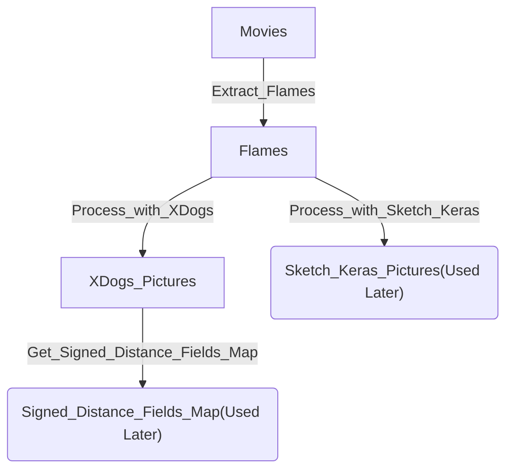

# DLAVC

Unofficial re-implementation of [*Deep Line Art Video Colorization with a Few
References*](https://arxiv.org/abs/2003.10685), which is used to convert videos with only black line borders to color videos.

### (My) Environments

* Python 3.7
* Torch 1.8
* opencv-python 4.4.0.42

### Some improvements

There are some improvements in pre-processing. You can refer to the flow chart below (the model of `Process_with_Sketch_Keras` can be downloaded [here](https://drive.google.com/file/d/1Zo88NmWoAitO7DnyBrRhKXPcHyMAZS97/view)) :

### Usage

* Run the files in `Pre_Process`  in the order of the flow chart above.
* Set the configuration and run `train3d.py`.
* Use `test3d.py` for testing.

#### P.S.

The task can be divided into two parts, and the first part, which is called "*Color Transform Network*", can convert pictures with only black line borders to color pictures. You can try it by using `train2d.py` and `test2d.py`.